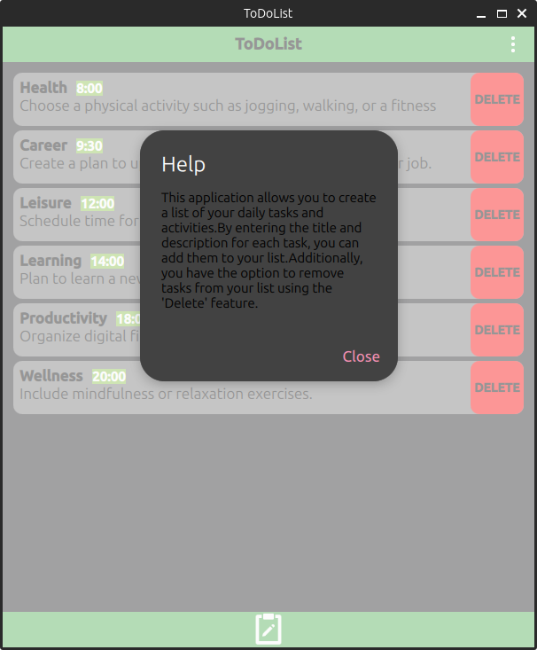
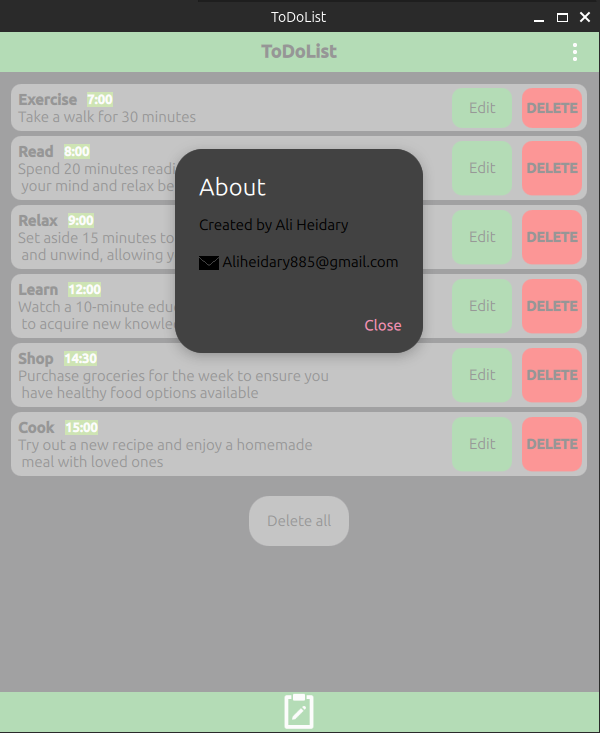

# ToDoList
- A simple todolist application using QML, a database, and C++.

## Building
- You need CMake tool for building source code
- CMake 3.16 or higher is required.

```
cd build
cmake ..
make
./appToDoList

```
## Demo






