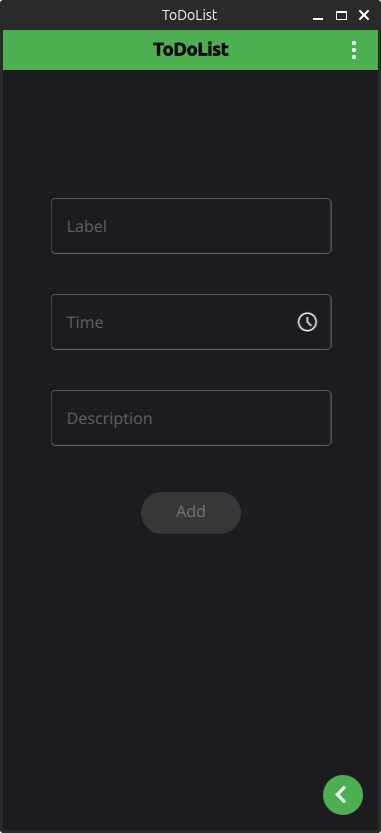
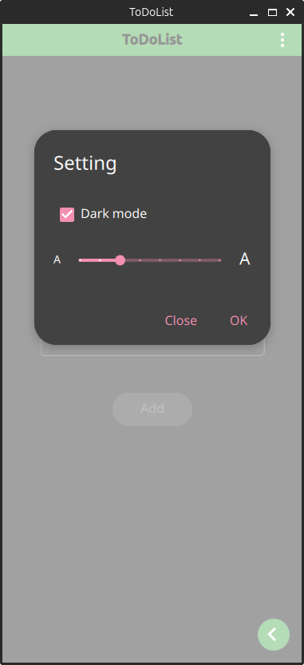

# ToDoList
- A simple todolist application using QML, a database, and C++.

## Features
- Add, edit, and delete tasks: Manage your tasks effectively with intuitive controls.
- Database integration: Tasks are saved using an SQLite database for persistent storage.
- User-friendly interface: Designed with QML for a modern and responsive UI.
- Cross-platform support: Runs on multiple platforms, including Windows, Linux, and Android.
  
## Building
- You need CMake tool for building source code
- CMake 3.16 or higher is required.

## Demo
- Here are some screenshots of the application in action:
- Main interface for managing tasks.
- Dialog for adding a new task.
- Dialog for editing an existing task.
- Overview of all saved tasks.
  

